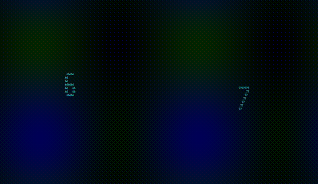

# six-seven


A small animated terminal display featuring the numbers six and seven.

The numbers move in opposite directions, cycle through colors and text styles, and react with a temporary POW effect.

## Installation

Install from crates.io:

```sh
cargo install six-seven-rs
```

Or build it from source:

```sh
git clone https://github.com/cndwood/six-seven-rs.git
cd six-seven-rs
cargo run --release
```

## Usage

Start the application:

```sh
six-seven
```

### Controls

| Key | Action |
|---|---|
| `6` | Trigger POW for six |
| `7` | Trigger POW for seven |
| `c` | Toggle color cycling |
| `s` | Toggle style cycling |
| `+` | Increase animation speed |
| `-` | Reduce animation speed |
| `F1` | Toggle the information panel |
| `q` | Quit |

## License

Licensed under the [MIT License](LICENSE).
